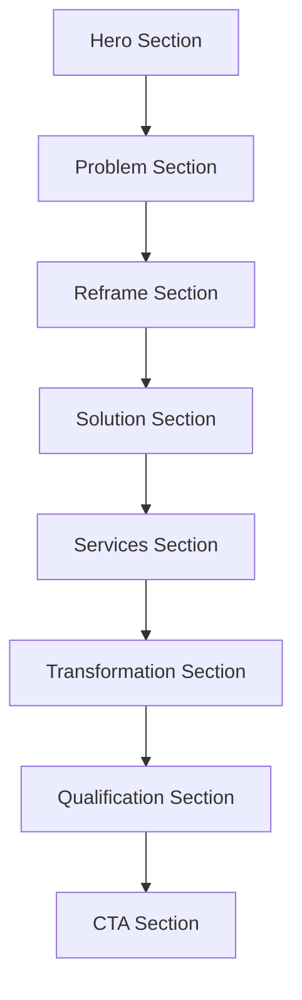

## 1. Product Overview

Founderin is a Founder-to-Market Architecture firm that transforms brilliant Japanese technical founders from invisible builders into companies the world can understand, trust, and back. We design the missing layer between founder's product and market through category design, user clarity, founder narrative, pitch architecture, and external voice systems.

Target audience: Technical founders in Japan building strong products but struggling with growth, user acquisition, and global expansion. They're product-first, introverted, brilliant but bad at explaining value, and skeptical of traditional marketing approaches.

## 2. Core Features

### 2.1 User Roles
Not applicable for this single landing page product.

### 2.2 Feature Module
Our landing page requirements consist of the following main sections:
1. **Hero Section**: Headline, subheadline, emotional pain bullets, bold reframing statement
2. **The Problem Section**: Describe founder isolation, show how products die quietly, name the feeling of being misunderstood
3. **The Reframe Section**: Position as founder-to-market gap, introduce missing company layer concept
4. **The Solution Section**: Define Founder-to-Market Architecture, differentiate from agencies, position as infrastructure
5. **What We Actually Do Section**: Service breakdown, content system, founder collaboration approach
6. **The Transformation Section**: Before/after narrative, credibility building
7. **Who It's For/Not For Section**: Qualify serious builders, filter out marketing seekers
8. **Call to Action Section**: High-status application process, conversation starter

### 2.3 Page Details

| Page Name | Module Name | Feature description |
|-----------|-------------|---------------------|
| Landing Page | Hero Section | Display primary headline "We turn brilliant Japanese founders into companies the world can understand", subheadline addressing investor/user disconnect, 3-4 emotional bullets about founder pain, bold reframing "It's not your product" |
| Landing Page | Problem Section | Describe founder isolation without using that phrase, show how great products die quietly, articulate the feeling of being misunderstood by investors and users |
| Landing Page | Reframe Section | State "This isn't a marketing problem", position as "founder-to-market gap", introduce concept of missing company layer between founder and world |
| Landing Page | Solution Section | Define "Founder-to-Market Architecture", differentiate from marketing agencies/PR/branding studios, position as infrastructure not output |
| Landing Page | Services Section | Clarify product and user understanding, design category positioning, rebuild pitch architecture, shape founder narrative, install zero-to-one content system, convert founder thinking into global signal |
| Landing Page | Transformation Section | Show before/after transformation from "smart but invisible" to "understood, trusted, fundable", build credibility through outcome positioning |
| Landing Page | Qualification Section | Define target audience as serious builders, explicitly state not for marketing seekers or vanity content creators |
| Landing Page | CTA Section | Provide calm, high-status call-to-action with "Apply" or "Start with a conversation", no hype or pressure tactics |

## 3. Core Process

The user journey flows through emotional resonance to logical understanding to action:

1. **Recognition**: Founder identifies with the pain described in hero section
2. **Validation**: Problem section confirms their experience of being misunderstood
3. **Reframing**: Realizes it's not a marketing problem but a founder-to-market architecture gap
4. **Solution Understanding**: Comprehends Founderin's unique positioning as infrastructure
5. **Service Clarity**: Understands specific services and transformation potential
6. **Self-Qualification**: Determines if they're the right fit (serious builder vs marketing seeker)
7. **Action**: Applies for conversation through high-status CTA

## 4. User Interface Design

### 4.1 Design Style
- **Primary Colors**: Deep charcoal (#1a1a1a), clean white (#ffffff), subtle gray (#f5f5f5)
- **Secondary Colors**: Professional navy (#2c3e50), accent silver (#c0c0c0)
- **Button Style**: Minimal rectangular with subtle hover states, no 3D effects
- **Typography**: Clean sans-serif (Inter or similar), headline sizes 48-64px, body text 16-18px
- **Layout Style**: Single column with generous whitespace, card-based content blocks
- **Icon Style**: Minimal line icons, no emojis, professional aesthetic

### 4.2 Page Design Overview

| Page Name | Module Name | UI Elements |
|-----------|-------------|-------------|
| Landing Page | Hero Section | Full-width dark background, centered white headline text, smaller subheadline, bullet list of pain points in Japanese and English, bold reframing statement with visual emphasis |
| Landing Page | Problem Section | Light background, two-column layout with text and subtle imagery, quotes from founders, statistics about startup failure rates |
| Landing Page | Reframe Section | Contrasting background color, large typography for key statements, diagram showing founder-to-market gap |
| Landing Page | Solution Section | Clean white background, icon-based service representation, comparison table vs traditional agencies |
| Landing Page | Services Section | Grid layout of service cards, each with icon and brief description, process timeline visualization |
| Landing Page | Transformation Section | Before/after comparison with testimonials, result metrics, credibility indicators |
| Landing Page | Qualification Section | Two-column layout clearly defining ideal vs non-ideal customers, filtering language |
| Landing Page | CTA Section | Minimal design with single prominent button, contact form integration, trust indicators |

### 4.3 Responsiveness
Desktop-first design approach with mobile optimization. The layout adapts gracefully from 1440px desktop to 375px mobile, maintaining readability and impact across all devices. Touch interactions are optimized for mobile users with appropriately sized tap targets.

### 4.4 3D Scene Guidance
Not applicable for this landing page project.