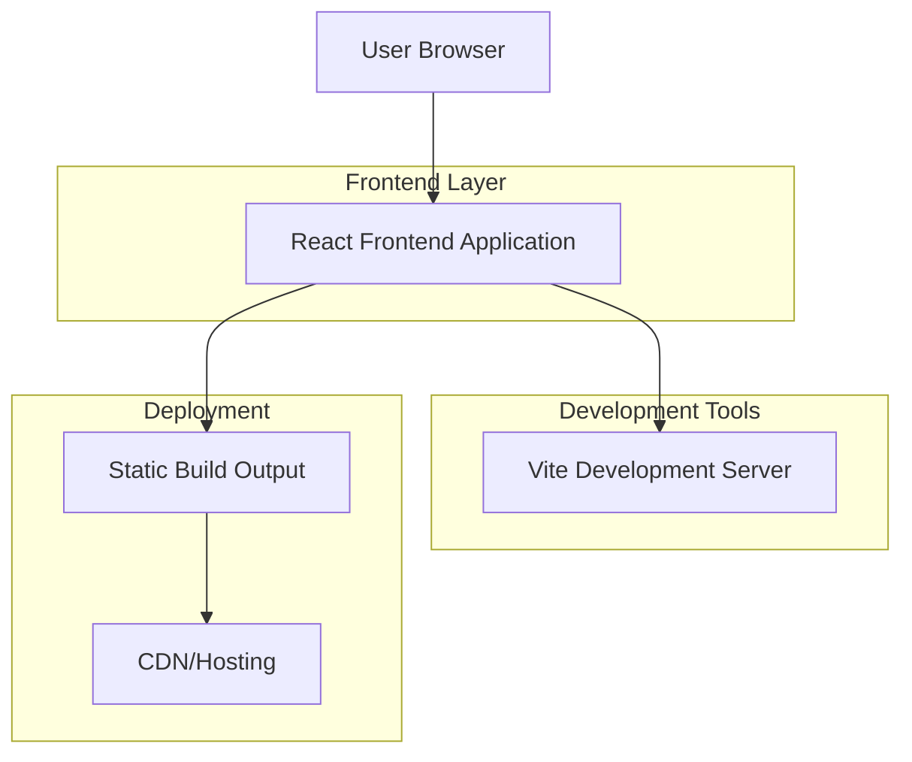

## 1. Architecture design

## 2. Technology Description

- **Frontend**: React@18 + Tailwind CSS@3 + Vite
- **Initialization Tool**: vite-init
- **Backend**: None (Static landing page)
- **Build Tool**: Vite for fast development and optimized production builds
- **CSS Framework**: Tailwind CSS for utility-first styling
- **JavaScript Framework**: React 18 for component-based architecture

## 3. Route definitions

| Route | Purpose |
|-------|---------|
| / | Landing page, displays all sections in single-page scroll experience |
| /apply | Application form page for founders to start conversation (optional secondary route) |

## 4. API definitions

Not applicable for this static landing page. All content is pre-rendered and served statically.

## 5. Server architecture diagram

Not applicable. This is a client-side only application with no backend services.

## 6. Data model

Not applicable. No database or persistent data storage required for this landing page.